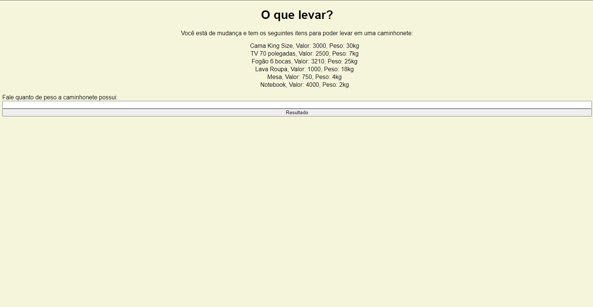
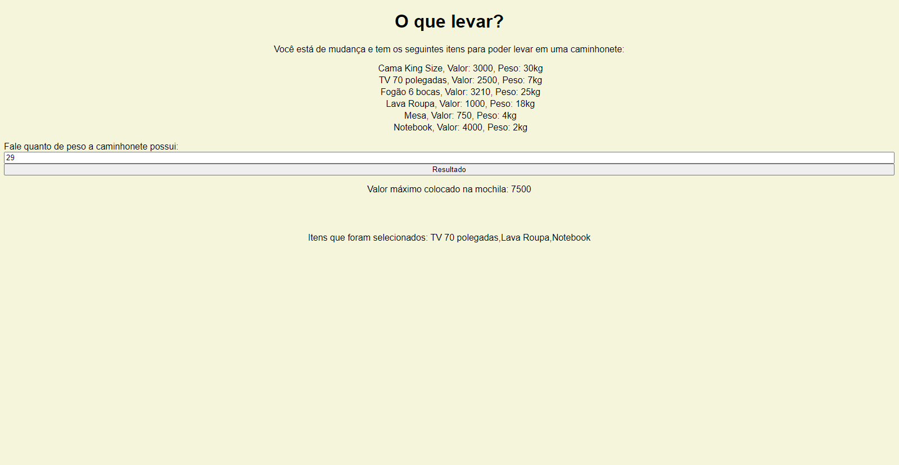

# O Que Levar

**Número da Lista**: 41 
**Conteúdo da Disciplina**: PD 

## Alunos
|Matrícula | Aluno |
| -- | -- |
| 16/0124581  |  Hugo Aragão de Oliveira|
| 20/2015984  |  Breno Henrique de Souza |

## Sobre 
O objetivo desse projeto é utilizar na prática o algoritmo Knapsack para
calcular a melhor combinação de itens para serem levados na caminhonete.

## Screenshots
Tela inicial:

Tela com tratamente de erros:

## Instalação 
**Linguagem**: Javascript 
**Framework**: Não foi utilizado 

Para rodar o projeto é necessário ter acesso a internet para clonar o repositório,
e ter um navegador instalado no computador(de preferência Chrome ou Edge), para rodar
o projeto localmente.

## Uso 
Clone o repositório e execute o server utilizando a extensão Live Server no seu VsCode.
A porta local é informada pela própria extensão quando executado.

Também é possível executar diretamente em seu navegador (caso tenha o projeto clonado em
sua máquina), apenas copiando o path do arquivo `index.html` e colando no navegador.

## Aprensentação

<video width="320" height="240" controls>
  <source src="pdKnapsack.mp4" type="video/mp4">
</video>

